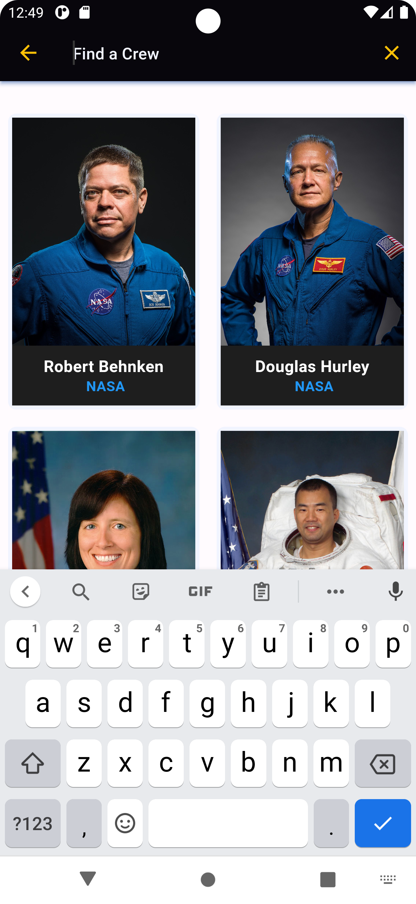
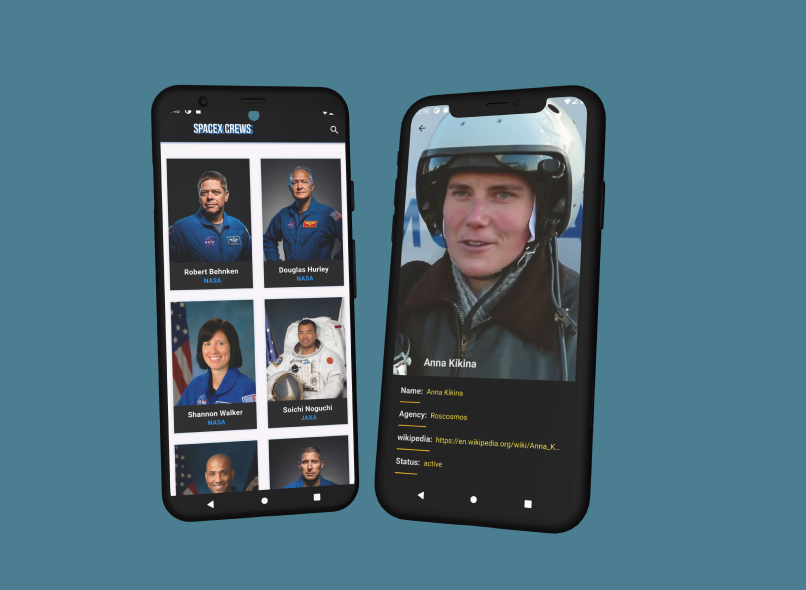

# Crew Space-X 

This Application shows a SpaceX Agency crew team using Bloc State Management.


## API Reference

#### Get all items:

```HTTP
  GET v4/crew
```

| Parameter | Type     | Description                 |
|:----------|:---------|:----------------------------|
| `api_key` | `string` | https://api.spacexdata.com/ |


## Tools:- 

- GradListView with builder.
- Bloc State Management.
- Clean Architecture in Flutter | MVVM | BloC | Dio.
- Hero Animation lip.
- Search and Filtrate about Crews.
- Cross-platform Using Flutter (Android & iOS).
- Network Check Connection.
- Lottie Animation.

## => Screens:

     &nbsp;&nbsp;&nbsp;&nbsp;       &nbsp;&nbsp;&nbsp;&nbsp;       
 
## => Mockup:


